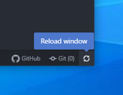

# reload-window
`reload-window` adds a button to the status bar and an option to the file menu to reload the current window.

## Installation
The clock can be installed through Atom from `File > Settings > Install`. Alternatively, you can use `apm`:

`apm install reload-window`

## Features
* "Reload Window" option in the file menu `File > Reload Window`
* A reload window button on the right-side of the status bar
* An option to disable the reload window button in the status bar

## Images
